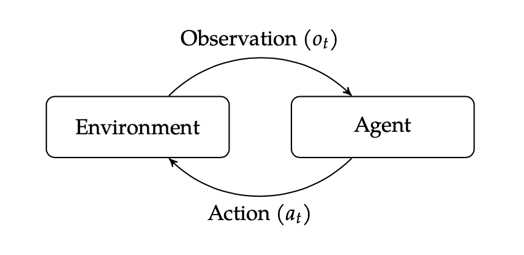

# 1. 认识决策

常常在鸡汤和成功学中见到“决策”或者其同义词的字眼，例如“选择大于努力”——做选择就是决策，这似乎是我们的直觉。经过多年的鸡汤教育，我们大家都很重视决策这件事，然而重视这件事不等于我们能在上面有所提高，因为还需要把决策认识清楚后才能做得好。

如前文所说，直觉上做选择就是做决策，然而这样说非常宽泛。我举几个反例，例如选择中午吃什么？吃包子、吃面条、吃米饭，假如你毫不在意吃什么，吃什么都不影响今天的心情，不影响任何事，那你做这个选择就谈不上决策，你无需付出什么决策成本，也得不到什么决策收益，选择任意一种都不会后悔。而另一个选择的例子，高考填志愿，就很不一样，选城市、选专业、选大学，非常劳神，害怕专业未来不吃香了，担心城市离家太远，担心大学不够气派，甚至怀着复读一年或许能考上更好的心情，在这么多选择中选一个就非常有所谓了。相比前一个例子，后者更像是我们关心的“决策”。

从这两个例子中可以明确出决策的第一个要素是：

> 决策要有选择，并且选择后的行动结果要有收益，不同的选择要有不同的收益，收益可正可负。

再看一个例子，我和我女儿玩手头剪刀布，我出什么就面临选择，似乎是要做决策，但是我女儿每次都只会出布，如果我一心要赢她的话，虽然每次面临选择，但我可以做到每一次都赢。如果我和另一个成年人玩这个游戏，那么我一心要赢他，就得猜一下对方可能要出什么。这两个例子对比之下，显然后者更像是我们关心的决策。这两个例子可以明确决策的另一个要素是：

> 决策得要面对不确定性环境，并且能看到不确定性环境的外在表现。

高考填志愿，面对的不确定是未来的学习环境。玩手头剪刀布，面对的不确定是另一个人的大脑。我们可以引申一下，决策要面对的一切不受决策者控制的部分，都叫做“环境”，包括其他决策者。

除了选择要有收益，以及选择要面对不确定性环境，决策中还有一个很重要的角色别忘了，那就是决策者，或者决策者的代理人，为了简化，我们还得认为决策代理人和决策受益人是同一个主体。决策的收益必须回到受益人身上，否则，决策就没有意义了。

综合一下，我们要学习的决策，是：有一个决策主体（Agent），面对不确定性环境（Environment），观察环境（Observation），观察结果对于决策主体来说就是反馈（Feedback），做出选择并行动（Action），得到不同的收益（Reward）。而“决策问题”就是：这个代理人，作为受益人，怎么做选择才能随着时间获得最大的收益？

决策问题为什么值得专门研究呢？以及为什么要引入数学方法研究呢？除了我们每一个人都想获得最大的收益外，还有以下原因逼迫我们研究决策问题：

* 环境具有不确定性。环境影响我们的收益，而且我们还对它不能完全掌握和认识，这就让我们不得不花力气去研究不确定的环境，研究的方法也不是为了让环境变得确定，而是能够把不确定的程度给量化出来。因此后面会大量引入概率论，用概率论来量化不确定性。

* 收益难以建模。虽然我们知道收益是决策追求，然而到底该如何在数学上把决策者“要什么”给表示出来，是很难的。有时候难在本身不可表示，例如收益是决策者的快乐；有时候是收益过于遥远，例如下棋的每一步落子，会在很多步之后才知道收益是赢是输；有时候收益本身是复杂多样的，例如一个商机分配，可能未来成交是收益，也可能经纪人得到一次真实商机锻炼是收益；有时候收益本身不是一个标量值，而是一个函数曲线，例如导弹要沿着最佳的轨迹飞行，保持与这个飞行曲线的贴合就是收益。

* 行动对环境的影响不确定。做出选择并采取行动后，可能会对外部环境本身造成影响，这个影响是不确定的。影响的不确定，加上本身外部环境对于决策者来说就是不确定的，两者综合一起增加了决策难度。我们听说过一句话，叫做“对方预判了我的预判”，这就是我的选择影响了对方，那我如果要优化我的选择就需要考虑到这一层影响。

* 其他玩家的影响不确定。往往一个决策者不是孤单的，还有其他人在和他面临相同的决策，他们也是这个决策问题的决策主体（Agent）。本质上来说，其他决策者其实也是不确定性环境（Environment）的一部分，不同于一般外部环境，其他决策者的目的对于当前决策主体是已知的，其他决策者的决策模型也是当前决策主体已知的。

决策主体在选择之后，观察环境并得到反馈，在下一次选择之前，如何根据环境的反馈有效调整自己的选择，就是决策算法的核心任务了。

# 2. 公司内外的决策型应用

## 2.1 飞机碰撞避让
为了避免两架飞机在空中相撞，我们想设计一个系统来对飞行员发出潜在威胁的警告，以及指示他们如何操纵飞机。这个系统与其他飞机的转发器通信，从而以一定的精确度获知它们的位置。就根据这些信息，要给飞行员提供什么指示?这是很难的。不确定性在于飞行员反应有多快。执行指示有多坚决。此外，航线上的其他飞机的行为也是不确定的。我们希望系统警告得足够早，从而给飞行员留出足够的时间操纵飞机避让，但是又不希望太早了，那会让飞行员做出不必要的操作来。因为这个系统要连续不断的在世界范围内使用，所以还需要系统具有特别的安全级别。

这个决策问题中，决策主体（Agent）是碰撞避让警告系统，环境（Environment）是空域中的其他飞机（连同其飞行员），Agent对环境的观察（Observation）来自其他飞机的转发器，可选择的行为（Action）就是飞机本身的操纵方法，收益（Reward）有：“没碰撞”和“没折腾”。

## 2.2 自动驾驶
L2及以上级别的自动驾驶系统，也是一个决策系统，它根据激光雷达和摄像头来自动感知路面情况，如果是辅助驾驶系统，还需要人类驾驶员自行的观察，根据感知到信号来选择加油、刹车、调整方向，以保障安全、快速到达目的地。光依靠激光雷达，则可能会监测到干扰信号，它依赖于被检测物对激光的反射，光依靠摄像头也可能会检测到干扰物，它依赖于提前对物体的标注，如果出现没有在样本中包含的物体，则会出现意外。加上路面上主要的其他决策主体是人，人的行为本身也不具有可预测性。

在自动驾驶的决策问题中，决策主体（Agent）是自动驾驶系统，环境（Environment）是汽车正在行驶的路面及路面上及周围的一切物体，Agent对环境的观察（Observation）来自激光雷达、摄像头及人类驾驶员，可以得到的反馈（Feedback）是路面的行人和车辆情况，可选择的行为（Action）就是加油、刹车、调整方向、保持等，收益（Reward）包括：安全到达目的地、出现事故等等。

## 2.3 商机分配
房地产网站都会对客户商机进行分配，分配给不同的房地产经纪人。具体来说，就是有一个商机分配引擎，它的任务是在一个客户想要一个经纪人为他服务的时候，为他匹配一个经纪人，每次匹配会影响到客户本身的体验，他的个人情况和购房诉求能否有适合他的经纪人为他提供后续服务，也可能会影响到经纪人的业绩，也会影响到平台在经纪人心中的形象，例如不同经纪人得到的商机数量和质量出现差异，他们是否认同，还会影响到新入行的经纪人在行业内如何能和资深经纪人共同竞争。一个商机分配给了一个经纪人，就不可能分配给另一个经纪人，这是决策问题中的一个典型特点，就是决策选择之间存在一定程度的互斥。

对于房产经纪领域的商机分配，从决策问题来看，它的决策主体是商机分配引擎（Agent），面对的不确定环境（Environment）是客户、经纪人，以及他们背后的门店，还有平台，甚至是当地政府，商机分配引擎要选择的行为（Action）可能是：具体分配给谁，或者不适合分配给经纪人个人。分配引擎对环境的观测（Observation）主要通过线上行为留痕，其他还有：客户的投诉工单，经纪人、平台职能主动提交的输入，或者是政府开出的罚单等，有即时的观测，也有滞后的观测，统统都是环境给我们的反馈（Feedback），都关系到最终的收益（Reward），客户体验良好地买到了心仪的房子，给平台传播了口碑，经纪人投入的时间都有所得，获得了良好的收入，获得了成就感，平台维护了生态的公平和健康，政府也嘉奖了贝壳公司。

跟商机分配类似的决策在贝壳内部还有：店对盘维护关系的分配。读者可以思考这个决策问题中，各个元素分别是什么。

## 2.4 小贝训练场

小贝训练场通过模拟客户人设，与房产经纪人完成一场虚拟对话交流，使经纪人熟悉房产知识、掌握沟通技能。为此，训练场需要准备好丰富的客户人设标签及对应的语言表达话术库，从而模拟出不同客户情景，通过模拟的情景将房产经纪人代入完成训练。但训练场的使用者——房产经纪人不一定会按照一个既定的对话流程进行，因此训练场不一定能达到训练他的目的，存在不确定性。如果训练场能让经纪人掌握设定知识或者走完设定的沟通SOP，就是训练场需要获得的收益。

在这个例子中，决策主体（Agent）是训练场，面对的不确定性环境（Environment）是经纪人，训练场每一次决策可以选择的行为（Action）是客户人设库中的话术，训练场可以从环境中观测（Observation）到的是：经纪人说的话，以及经纪人在操作训练场软件时的行为，例如重复问训练场问题，中途退出等行为，就是可以观测到的负反馈（Feedback），训练场可以得到的正收益（Reward）有：经纪人正确讲到的知识点数，挖掘到客户人设的需求数，对训练场的五星好评等。除此之外，也有可能有负收益：例如中途退出，超长的训练时间，不满意的评价反馈，对训练场的有效提问和讲解知识点数为0，等等。

# 3.决策方法概览

以下列举的决策方法仅仅是简单说明，待后续详细学习每一种方法后，再回来重新概括这些方法。

## 3.1 显式编程

就是提前设定好一个供决策的映射表，有点诸葛亮锦囊妙计的意思。遇到情况A，该做什么，遇到情况B该做什么，诸如此类。也就是我们平常说的“写死的规则”。这种方法的问题就是没有考虑Environment的不确定性，如果Environment的Feedback没有提前预料到，那么就无法做决策或者是一个很差的决策。而且，显式编程还不管Reward的大小，视为相同，如果将显式编程作为决策型应用的主要决策方法，这个应用是无法长期发展迭代的，毕竟Environment总是在变化。一旦有经过检验的业务规则，显式编程也是不要排斥的好方法，因为它的决策过程非常高效。

## 3.2 监督学习
监督学习是机器学习中非常重要的一类学习方法。它需要收集已经发生的决策结果作为学习样本，这些样本记录了当时决策时的观测结果Observation，和决策取得的收益Reward。用这些样本指导学习算法从中学到决策因素的组合方式（线性组合、树状组合、网络组合等），以及组合时各个决策因素的权重，它学习的原理就是：先人工选定决策因素，再设计一个组合方式，然后随机赋予他们权重，这样就可以用这一个简陋的决策方法开始重新预测每一条样本的收益，计算出预测结果和实际结果的差距，用这个差距重新调整决策因素的权重，样本越多，决策因素的权重就被调整得越好。这个过程中，关键就是学习样本自带的收益标签，它在“监督”决策算法的学习，因此叫做监督学习。

常见的监督学习方法还有两个隐藏的数学假设：1）学习样本之间互不影响，互相独立；2）实际遇到的样本概率分布和学习样本的概率分布相同。目前监督学习是决策型应用的主流方法，广泛应用于搜索推荐广告场景。商机分配也使用了监督学习方法作为主要的决策方法，但这实际上并不符合现实：一个商机分给了经纪人A，就不会分给经纪人B，每一个经纪人也有自己的商机服务能力上限。这和搜索推荐中一个物品item可以重复给很多用户推荐非常不同，也不一定符合监督学习的数学假设。

## 3.3 最优化方法
这一类方法用于找到可能的决策策略空间和衡量决策策略效果。评估决策策略的效果，往往就要运行一定量的策略仿真，最优化算法从这些仿真结果空间中搜索一个最佳的决策策略。如果仿真空间的维度不高，并且策略效果不存在过多的局部最优点，那么一些局部搜索或者全局搜索算法都很合适。最优化方法要先设定一些关于动态模型的知识，否则没法做策略搜索。如果遇到复杂问题，这一点可能非常重要。

## 3.4 规划方法
规划(Planning)是一种特定的最优化方法，它对问题的动态过程建模，来指导策略搜索。有很多文献都在讨论规划问题，大多数集中在静态问题(Deterministic problems)上。但是对于某些动态问题，如果能够用一个静态模型逼近，也可以接受。把决策问题假设成一个静态模型，就能使用那些较为容易扩展成高维问题的方法了。对于其他问题，对未来的不确定性能给出解释则至关重要。

## 3.5 强化学习
强化学习放宽了规划方法的强假设（静态问题），预先不知道问题的模型，决策的策略产生于智能体在和环境互动过程中的学习。智能体的设计者只需要设计出效果评估方法即可，其余的就交给学习算法来优化智能体的行为。强化学习表现出来的复杂性，有一点很有意思，那就是行为的选择不仅影响智能体当前完成目标成功与否，而且影响智能体两个能力:从环境中学习的能力，和对问题可利用特性识别的能力。

# 4. 决策研究历史

// 这个不重要，总之是一个交叉学科。
