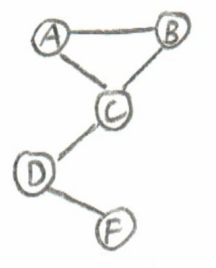

# 1 复习概率分布

## 1.1 随机变量
在与决策初见面的时候，列举了决策困难之处，其中有三个都跟不确定有关：

1. 环境具有不确定性；
2. 行动对环境的影响不确定；
3. 其他玩家的影响不确定。

不确定成了做出好决策的关键拦路虎。于是在学习决策方法前，要先学习“不确定性”。不确定性，有很多直觉上的解释，例如关于事实发生可能结果的分布，也有关于对某件事发生的信心的反应。在数学上，则是诉诸概率论来研究不确定性。

概率论的基础是假设一切不确定，都是因为存在随机变量。随机变量，与之相对的是确定变量，我们在编程中，给一个变量赋值了，它就是确定变量，但在没有赋值之前，本质上它就是一个随机变量，还不知道会给它赋上什么值。编程语言中的常量，就是非随机变量，无论什么情况下，它的取值都不变。

显然，随机变量是在我们取到值之前，无法确定它确切的值是什么，这就是不确定性理论体系——概率论的基础单元了。

再进一步，把一个随机变量取值分成两种，一种取值方式是从一个有限集合（set）中取一个元素作为值，例如性别是从男、女两种中取一个，明天天气是从阴、晴、雨、雪、风、雾这个集合中中取一个；另一个取值方式则是从数轴上取一点，也就是一个连续值，由于数轴上的任意范围内的点都是无穷个，所以这种随机变量可以取得值就是无穷多个，无论取值范围是多大，都是无穷个，例如明天的温度，是一个数值。当然，在数轴上取一个点，在实际上跟我们的测量精度有关系，一个设定的精度下，实际上取值是有限的，例如明天的问题，精确到0.1摄氏度，在一个有限的范围内就是有限的数值了，记住我们聊的理论上有无穷个点，所以这里请杠精后退。

前一种取值方式的随机变量，叫做离散随机变量；后一种取值方式的随机变量，叫做连续随机变量。随机变量还可以通过组合和变换，形成新的随机变量，一切的基础都因为单个随机变量不能取一个确定的值，这个在以后会看到。

## 1.2 离散概率分布

先看第一种随机变量，取值来自一个集合的元素这种：离散随机变量。离散随机变量的概率分布是这样定义的：

1. 每一种取值的概率都介于0到1之间；
2. 所有取值的概率的总和为1.

$$
\sum_{i=1}^{n}{P(X=i)}=1
$$

$$
0 \leq P(X=i) \leq 1
$$

举个例子如下图：

随机变量X一种可以取的值是集合{1, 2, 3, 4, 5, 6}中的一个，每一个取值的概率都小于1，大于0，概率总和为1。

离散随机变量非常容易理解，符合我们的直觉，人看待世界的习惯就是分开看，把对象看成一个集合。实际上我们的确在实际应用中把连续变量转换成离散变量来对待，不仅仅是符合直觉，还因为可以降低计算复杂度，或者因为数据稀疏，不得不转换成离散变量，例如我们常常把年龄转换成离散变量，把用户的价格偏好转换成离散变量。

下面看连续随机变量。

## 1.3 连续概率分布

连续随机变量的取值是数轴上的一个点。借鉴离散随机变量的概率分布性质，显然所有点的取值概率累加在一起应该为1。由于是数轴上无穷多个点，所以对无穷多个点的累加，其实就是积分。

$$
\int_{-\infty}^{+\infty}{p(x)dx}=1
$$

但另一个问题是：每一个数据点的概率值是多少呢？因为有无穷多个数据点，所以每一个数据点的概率其实是无穷小。也就是谈论连续随机变量某个具体取值的概率是没有意义的，谈论它的概率密度更有意义。

概率密度，通俗理解，就是某个数据点稍微往外扩一点点宽度，得到一个狭小的长方形，它的性质应该和离散随机变量其中一个取值的概率性质相同，用狭小长方形的面积表示它的概率，就和离散随机变量分布的每一个取值概率一样（规定离散随机变量的直方图宽度为1）。

如果这个狭小的长方形的宽度为 $dx$，他们它的高度就是这个数据点的概率密度。每一个数据点的概率密度值都画出来，就得到了概率密度曲线——连续随机变量就用概率密度曲线表达其概率。

注意到上面的内容中，概率密度用了小写字母p表示，而概率用大写字母P表示。

虽然谈论一个数据点的概率没有意义，但是谈论一个数据范围的概率是有意义的，尤其是谈论$P(X \leq x)$ ，即某个值x以下的概率是多少。注意到，这里把一个数轴划分成了两段，相当于把原来的随机变量X变换成了一个有两个离散的取值离散随机变量：$X \leq x$ 和 $X \geq x$。

对$P(X \leq x)$ 有一个专门的名词，叫做“累计分布函数”（CDF），也就是从无穷小处开始累积到数据点x处，其概率函数。

$$
cdf_X(x)=P(X\leq{x})=\int_{-\infty}^{x}{p(x^{\prime})dx^{\prime}}
$$

比如一个正态分布，在它的均值 $\bar{x}$ 处，cdf函数取值就是 $cdf(\bar{x})=0.5$。

在连续概率分布中，有几个概率分布相当常见，并且有很多内在联系。

* 均匀分布

在区间[a, b]的均匀分布如图所示：

在区间内，处处概率密度都是 $\frac{1}{b-a}$，在区间外，处处都是0。

累计分布函数如下：

在到达a之前，概率累积一直是0，从a到b是线性累积，累积的斜率就等于该区间的概率密度，超过b之后，累积概率到达1，不再变化。

连续均匀分布，一旦离散化后，也很容易理解，例如在[a,b]区间划分为等分的k个区间，k个区间，就是一个离散均匀分布。离散均匀分布每一个取值的概率相同，概率和为1。

* 高斯分布（正态分布）

高斯分布，又称为正态分布，钟形分布。是应用最广泛的概率分布。有很多自然现象，如果采集数据，其对应的随机变量都是高斯分布，最常见的高斯分布就是白噪声。

高斯分布的概率密度函数如下（ $\mu$ 是均值，$\sigma$是方差）：

$$
N(x|\mu,\sigma^{2}) = \frac{1}{\sigma}\phi(\frac{x-\mu}{\sigma})
$$

其中：

$$
\phi(x)=\frac{1}{\sqrt{2\pi}}\exp(-\frac{x^2}{2})
$$

* 混合高斯分布

混合高斯分布是n个符合高斯分布的随机变量，线性加权后得到一个新的随机变量所符合的分布。

假如n个随机变量其高斯分布的参数分别是 $\mu_{1:n}$ 和 $\sigma_{1:n}$，加权的权重分别是 $\rho_{1:n}$，且权重之和等于1。混合高斯分布就表示为：

$$
p(x|\mu_{1:n},\sigma_{1:n}^2,\rho_{1:n}) = \sum_{i=1}^{n}\rho_iN(x|\mu_i,\sigma_i^2)
$$

一个简单的高斯混合分布如下图：

红色是混合高斯分布，蓝色是三个不同的高斯分布，均值和方差各不相同，经过相同权重叠加后，成为红色部分的混合高斯分布。

这里的随机变量都是一个标量。如果是二维向量，或者高维向量，如果假设向量中每一个元素都是高斯分布，那么他们也可以构成混合高斯分布。这也是一个简单的聚类算法理论基础，如下图所示，是一个二维向量的混合高斯分布，同时也可以看出，是两个高斯分布的混合，这两个高斯分布就是两个聚类。

## 1.4 联合概率分布
联合概率分布是关于同时考虑多个变量的概率分布。设想两个随机变量，一个是明天的温度，一个是明天降雨量，这是两个不同的随机变量，但现在要把他们放在研究，既要看温度，又要看降雨量。例如我们问降雨量小于10毫升且温度是零下的概率，这个概率就是一个联合概率分布了。

两个随机变量X和Y，他们分别取值x和y的联合概率就是P(x,y)。跟联合概率分布紧密相关的概念是边缘分布。所谓边缘分布，就是把联合概率分布的另一个变量的不确定性抹掉。

例如P(x)是离散随机变量x的边缘分布：

$$
P(x)=\sum_{y}{P(x,y)}
$$

离散边缘分布是贯穿本书的一个定律。

连续随机变量x的边缘概率密度：

$$
p(x)= \int{p(x,y)dy}
$$

算了一个积分，相当于也是把另一个变量所有可能都累积起来。

离散的联合概率分布，在实际问题中常常见到，可以用多个变量的笛卡尔积来表示其概率分布，此外，还可以用决策树来表示离散变量的联合概率分布，一条路径就是一个随机变量的组合，图中红线是取值为0，蓝线是取值为1：

## 1.5 条件概率分布

如果是联合概率分布表达的是多个不确定性同时考虑的话，条件概率分布表达的就是假设一个随机变量先确定下来后，另一个随机变量的不确定性。条件概率的概念相当有用，在实际问题中，多个变量同时存在，为了降低难度，都是研究其中一个变量确定的情况再研究另一个随机变量。

条件概率定义，要用到联合概率分布，毕竟要先搞清楚两个不确定性综合表现，再确定其中一个研究另一个：

$$
P(x|y)=\frac{P(x,y)}{P(y)}
$$

$$
P(y|x)=\frac{P(x,y)}{P(x)}
$$

因此：
$$
P(x,y)=P(x|y)P(y)=P(y|x)P(x)
$$

表达离散随机变量的条件概率依然可以用表格或者决策树。

有一个有意思的条件概率分布：一个离散二值变量在一个连续随机变量条件下的概率分布。这其实是sigmoid模型：

$$
P(x^1|y)=\frac{1}{1+exp(-2\frac{y-\theta_1}{\theta_2})}
$$

其中 $\theta_1$表示阈值的位置，$\theta_2$表示分布的陡峭程度。
下图是 $\theta_1=0$时的分布形状：

sigmoid函数被应用最广泛就是在CTR预估中，预测用户行为是否发生，这就是一个二值随机变量，取值是1（行为发生）和0（行为不发生），所依据的条件随机变量是一切可能相关的因素的加权和，显然这是一个连续随机变量。

# 2 专题：贝叶斯网络

贝叶斯网络是一种系统地描述随机变量之间关系的语言，它模拟了人类推理过程中因果关系的不确定性。它是一个有向无环图，它的一个节点是一个随机变量，它的边就是表示两个随机变量的概率关系，可以表示多个随机变量之间的联合概率和条件概率。

每一个节点 $X_i$是一个条件概率分布$P(X_i|Pa(X_i))$，其中$Pa(X_i)$是有向无环图中$X_i$的父节点。

下入示意了一个关于卫星监控的贝叶斯网络。

其中的随机变量分别是：
B：电池故障
S：太阳能帆板故障
E：电子系统故障
D：轨迹偏差
C：通信丢失

从图中可以看出：电池故障的条件下会有一定概率的电子系统故障发生，太阳能帆板故障条件下也有一定概率发生电子系统故障，电子系统故障条件下，会有一定概率发生轨迹偏差，也会有一定概率发生通信丢失。

贝叶斯网络由于是有向无环图，所以它是能找到根节点的（可能有多个），例如上面的例子，B和S就是跟节点，逐一跟节点没有父节点，所以他们的概率分布就是边缘分布P(B)和P(S)。根据贝叶斯网络，计算卫星一切都没问题的概率：

$$
P(b^0,s^0,e^0,d^0,c^0)=P(b^0)P(s^0)P(e^0|b^0,s^0)P(d^0|e^0)P(c^0|e^0)
$$

贝叶斯网络之所以能更简单明了表示多个随机变量之间的复杂关系，是因为某些随机变量之间存在条件独立。我们说随机变量X和Y条件独立，是说：$P(X,Y|Z)=P(X|Z)P(Y|Z)$。在一个贝叶斯网络中，观察到一些证据的条件下，如何知道两个随机变量是不是条件独立呢？这要用到一个方法，叫做“D分离”。

“D分离”是这样的方法：
1. 首先去掉跟判断无关的变量，例如判断P(A,B|C)是否等于P(A|C)P(B|C)，那就从贝叶斯网络中去掉与ABC无关的变量和边；
2. 把有向边变成无向边，同一个节点的父亲之间用线连上；
3. 删除作为证据的条件变量，看看待判断的变量之间是否存在路径，若存在，则条件不独立，若不存在则条件独立。

例如，下面这个贝叶斯网络，有7个随机变量。

我们要判断给定D和F作为条件，A和B是不是条件独立的？P(A,B|D,F)=P(A|D,F)P(B|D,F)?

第一步：去掉无关变量(只保留ABCDEF，为什么C没去掉？因为C是D的父亲，不是无关的)

第二步：把有向边变成无向边，同一个节点的父亲用线连上（A和B被连上了）。

第三步：删除作为证据的条件变量

可以看出，A和B之间有路径，不是条件独立的。

上面是一个形象表示，实际上D分离是一个简单的概率推理算法，可以自己尝试用python代码实现D分离。

# 3 用概率做简单推理
